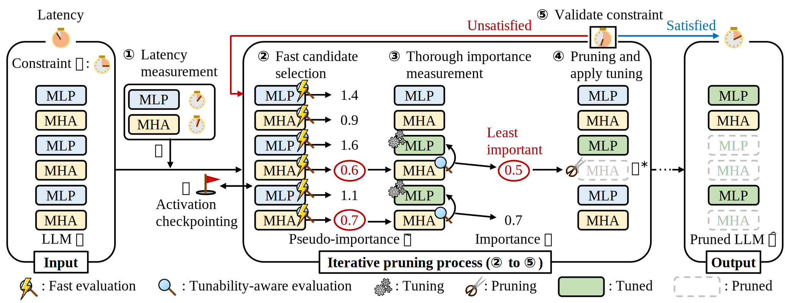
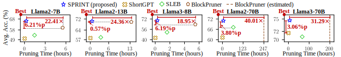

# Accurate Sublayer Pruning for Large Language Models by Exploiting Latency and Tunability Information
This package contains a PyTorch implementation of SPRINT.
## Overview
### Overview of SPRINT
<p align="center"></p>


**SPRINT** (<u>**S**</u>ublayer <u>**PR**</u>uning w<u>**I**</u>th Late<u>**N**</u>cy and <u>**T**</u>unability Information) is an efficient sublayer pruning algorithm for Transformer-based large language models (LLMs) without loss of accuracy. The main ideas of SPRINT are as follows:

**(a) Latency-aware importance scoring.**
SPRINT estimates the latency of each sublayer, and evaluates its importance by combining both latency and sensitivity.

**(b) Tunability-aware sensitivity evaluation.**
SPRINT evaluates the sensitivity of each sublayer considering its tunability.

**(c) Avoiding unnecessary computations.**
SPRINT stores intermediate activations and performs a fast candidate selection process to avoid unnecessary computations when selecting pruning targets.

### Experimental Results
<p align="center"></p>
SPRINT demonstrates the best accuracy-pruning time trade-off among competitors by generating the most accurate model which shows up to <b>6.21%p</b> higher accuracy than others within <b>22.41&times;</b> shorter time than the second-best algorithm.

### Code Description
This repository is based on the codes in the [GitHub](https://github.com/jiwonsong-dev/SLEB.git). The following is an overview of our codes.
```
SPRINT
│
├─  src
│   ├─ lm_evaluation_harness          : codes for evaluating models on CSR tasks.
│   ├─ utils
│   │   ├─ CompressionManager.py      : codes for the class supporting compression-related functions.
│   │   ├─ compression_utils.py       : codes for latency approximation, candidate selection, and importance scoring.
│   │   ├─ data_utils.py              : codes for utilities loading data.
│   │   ├─ eval_utils.py              : codes for utilities evaluating models.
│   │   ├─ general_utils.py           : codes for utilities related to activations, modules, GPU, and others.
│   │   ├─ latency_utils.py           : codes for utilities measuring the latency of models
│   │   └─ onoff_llama.py             : codes for the class supporting sublayer pruning
│   ├─ sprint.py                         : main codes for running SPRINT
│   └─ load_and_evaluate.py           : codes for loading and evaluating pruned models
│
├─ scripts                            : a directory for script files
│   ├─ evaluate.sh                    : a script file for evaluating the pruned model (7B, 8B, 13B)
│   ├─ evaluate_70B.sh                : a script file for evaluating the pruned model (70B)
│   ├─ run_sprint.sh                     : a script file for running SRPINT (7B, 8B, 13B)
│   └─ run_sprint_70B.sh                 : a script file for running SPRINT (70B)
│
└─ README.md
```

## Prerequisite
### Install dependencies
The list of dependencies is as follows:
* python >= 3.10.12
* tqdm 4.66.4
* numpy 1.26.4
* torch 2.3.1
* datasets 2.20.0
* transformers 4.43.0.dev0
* accelerate 0.33.0.dev0
* fire 0.6.0
* sentencepiece 0.2.0
* protobuf 5.27.2

Install dependencies using the following command:
```shell
pip install -r requirements.txt
```
Install [lm-eval](https://github.com/EleutherAI/lm-evaluation-harness) package using the following command:
```shell
cd src/lm_evaluation_harness
pip install -e .
```
Install [evaluate](https://github.com/huggingface/evaluate) package using the following command:
```shell
git clone https://github.com/huggingface/evaluate.git
cd evaluate
pip install -e .
```
### Datasets
Our code automatically downloads the dataset needed when you run our `sprint.py` file. You do not have to prepare the dataset manually.

## Running
### Key arguments of SPRINT
**Arguments for initializing**
* `model_name`: the path of the directory for the dense model
* `dataset`: the name of the sample dataset
* `nsamples`: the number of samples in the sample dataset
* `seed`: a random seed
* `num_cpu_layers`: the number of layers loaded on RAM
* `num_remove_sublayers`: the number of sublayers to remove
* `target_speedup`: the target speedup degree
* `output_dir`: the path of the directory for storing the pruned model, evaluation results, and logging file
* `cache_dir`: the path of the directory for loading cached samples
* `result_file`: the name of the file for storing evaluation results
* `logfile`: the name of the logging file
* `pruned_model_file`: the path to save the resulting pruned model

**Arguments for intermediate evaluation**
* `eval_every_step`: whether to evaluate a model every step
* `eval_steps`: on which steps to evaluate a model 
* `eval_speedups`: on which speedup degree to evaluate a model

**Arguments for speedup estimation**
* `generation`: whether a model generates tokens
* `generation_length`: the number of tokens for a model to generate (only if `generation==True`)
* `prompt_length`: the number of tokens in the prompt
* `speedup_batch_size`: the size of a batch for estimating speedup
* `speedup_iteration`: the number of iterations for estimating speedup

**Arguments for importance scoring**
* `sensi_batch_size`: the size of a batch for measuring sensitivities
* `metrics`: the metrics for measuring sensitivities denoted as the combination of a distance metric (i.e., L1 norm, L2 norm, or cosine dissimilarity) and a normalization type (i.e., sentence-wise, token-wise, channel-wise, element-wise, or None)
* `latency_aware`: whether to be aware of the latency
* `tuning_sublayer`: the type of sublayer subject to tune
* `in_comp_tuning`: whether to do in-compression tuning
* `update_tuned_weights`: whether to update the tuned weights
* `in_comp_tuning_dtype`: the data type for in-compression tuning
* `direction`: the channel direction for selecting weights for tuning
* `num_candidate_sublayers`: the number of candidate sublayers to be pruned
* `in_comp_tuning_ratio`: the ratio of channels to be tuned during in-compression tuning
* `damping_coefficient`: the damping coefficient for regularization
* `num_checkpoints`: the number of checkpoints for storing activations
* `checkpointing_on_cpu`: whether to store checkpoints on RAM

### A code for running SPRINT
The following code is an example of generating 40% accelerated Llama3-8B.
```bash
cd src
CUDA_VISIBLE_DEVICES=0 python -u -m sprint \
    --model_name 'meta-llama/Meta-Llama-3-8B' \
    --target_speedup 1.41
```
We provide the code for running SPRINT as in `scripts/run_sprint.sh`. Run the script file as follows:
```shell
bash scripts/run_sprint.sh
```
If you want to evaluate the pruned model, use `load_and_evaluate.py` file as in `scripts/evaluate.sh`. Run the script file as follows:
```shell
bash scripts/evaluate.sh
```
We provide `scripts/run_sprint_70B.sh` and `scripts/evaluate_70B.sh` for running 70B models on two GPUs. Run the script files as follows:
```shell
bash scripts/run_sprint_70B.sh
```
```shell
bash scripts/evaluate_70B.sh
```

## Reference
If you find SPRINT useful or relevant to your research, please kindly cite our paper:
```bibtex
@inproceedings{park2025sprint,
  title={Accurate Sublayer Pruning for Large Language Models by Exploiting Latency and Tunability Information},
  author={Park, Seungcheol and Lee, Sojin and Kim, Jongjin and Jo, Hyunjik and Kang, U},
  booktitle={The Thirty-Third International Joint Conference on
            Artificial Intelligence},
  year={2025}
}
```

## License
This repository is for research purposes only. For any other purposes, please contact the authors.

## Related Projects
* [SLEB](https://github.com/jiwonsong-dev/SLEB.git) ([ICML'24](https://proceedings.mlr.press/v235/song24f.html))
* [OmniQuant](https://github.com/OpenGVLab/OmniQuant.git) ([ICLR'24](https://openreview.net/forum?id=8Wuvhh0LYW))
* [Language Model Evaluation Harness](https://github.com/EleutherAI/lm-evaluation-harness.git)
